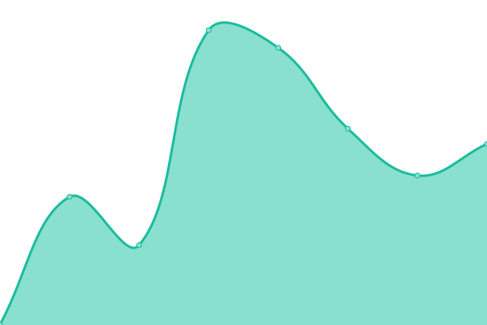
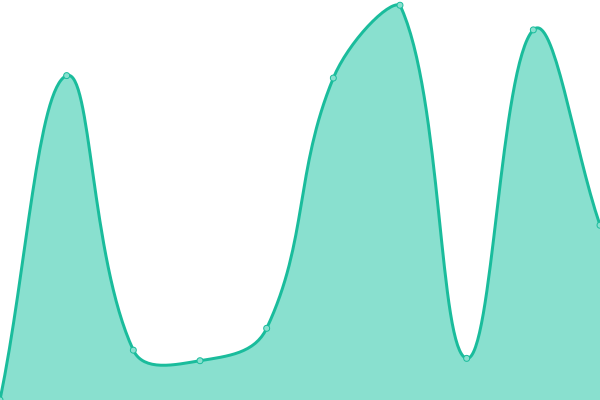

# [📈 Live Status](https://akram-osg.github.io/westside-watcher): <!--live status--> **🟩 All systems operational**

This repository contains the open-source uptime monitor and status page for [Akram Be](https://akram-osg.github.io/westside-watcher), powered by [Upptime](https://github.com/upptime/upptime).

With [Upptime](https://upptime.js.org), you can get your own unlimited and free uptime monitor and status page, powered entirely by a GitHub repository. We use [Issues](https://github.com/akram-osg/westside-watcher/issues) as incident reports, [Actions](https://github.com/akram-osg/westside-watcher/actions) as uptime monitors, and [Pages](https://akram-osg.github.io/westside-watcher) for the status page.

<!--start: status pages-->
<!-- This summary is generated by Upptime (https://github.com/upptime/upptime) -->
<!-- Do not edit this manually, your changes will be overwritten -->
<!-- prettier-ignore -->
| URL | Status | History | Response Time | Uptime |
| --- | ------ | ------- | ------------- | ------ |
|  [Westside Market](https://www.westsidemarket.com) | 🟩 Up | [westside-market.yml](https://github.com/akram-osg/westside-watcher/commits/HEAD/history/westside-market.yml) | 

 419ms
     
 | 

<a href="https://akram-osg.github.io/westside-watcher/history/westside-market">100.00%</a>
    

|  [Westside Market (Odoo)](https://app.westsidemarket.com) | 🟩 Up | [westside-market-odoo.yml](https://github.com/akram-osg/westside-watcher/commits/HEAD/history/westside-market-odoo.yml) | 

 1095ms
     
 | 

<a href="https://akram-osg.github.io/westside-watcher/history/westside-market-odoo">100.00%</a>
    

|  [Westside Market (API)](https://api.westsidemarket.com/v2/states) | 🟩 Up | [westside-market-api.yml](https://github.com/akram-osg/westside-watcher/commits/HEAD/history/westside-market-api.yml) | 

 963ms
     
 | 

<a href="https://akram-osg.github.io/westside-watcher/history/westside-market-api">100.00%</a>
    

|  [Westside Market (Members Portal)](https://members.westsidemarket.com) | 🟩 Up | [westside-market-members-portal.yml](https://github.com/akram-osg/westside-watcher/commits/HEAD/history/westside-market-members-portal.yml) | 

 201ms
     
 | 

<a href="https://akram-osg.github.io/westside-watcher/history/westside-market-members-portal">100.00%</a>
    

|  [Odoo Development](https://development.westsidemarket.com) | 🟩 Up | [odoo-development.yml](https://github.com/akram-osg/westside-watcher/commits/HEAD/history/odoo-development.yml) | 

 5086ms
     
 | 

<a href="https://akram-osg.github.io/westside-watcher/history/odoo-development">100.00%</a>
    

|  [Odoo Staging](https://staging.westsidemarket.com) | 🟩 Up | [odoo-staging.yml](https://github.com/akram-osg/westside-watcher/commits/HEAD/history/odoo-staging.yml) | 

 12772ms
     
 | 

<a href="https://akram-osg.github.io/westside-watcher/history/odoo-staging">100.00%</a>
    

<!--end: status pages-->

[**Visit our status website →**](https://akram-osg.github.io/westside-watcher)

## 📄 License

- Powered by: [Upptime](https://github.com/upptime/upptime)
- Code: [MIT](./LICENSE) © [Anand Chowdhary](https://anandchowdhary.com), supported by [Pabio](https://pabio.com)
- Data in the `./history` directory: [Open Database License](https://opendatacommons.org/licenses/odbl/1-0/)
